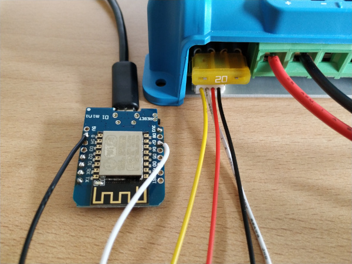

# Victron-ESPHome

ESPHome component to monitor a Victron device via VE.Direct / UART TTL

## Supported devices

All Victron devices providing a VE.Direct port.

## Requirements

* [ESPHome 2021.10 or higher](https://github.com/esphome/esphome/releases).
* Generic ESP32 or ESP8266 board

## Schematics

Attention: [The TX voltage of the VE.Direct interface depends on the product: Some are 5V, others 3.3V!](https://www.victronenergy.com/live/vedirect_protocol:faq#q4is_the_vedirect_interface_33_or_5v)

Please measure the voltage between TX and GND. In case of a logic level of 5V you should add a voltage divider or logic level converter between the ESP and the Victron device.

```
                UART-TTL
┌────────────────┐                ┌──────────────────┐
│           GND o│<-------------->│o GND             │
│ Victron    TX o│--------------->│o D7   ESP32/     │
│ Charger    RX o│                │       ESP8266    │<-- GND
│            5V o│                │                  │<-- 3.3V
└────────────────┘                └──────────────────┘

# UART-TTL jack (JST-PH 2.0mm pinch)
┌─── ─────── ────┐
│                │
│ O   O   O   O  │
│GND  RX  TX VCC │
└────────────────┘
```

If you are unsure about to pin order please measure the voltage between GND and VCC (5V). If you measure a positive voltage you know the position of VCC and GND!

### JST-PH jack

| Pin     | Purpose      | ESP pin        |
| :-----: | :----------- | :------------- |
|  **1**  | **GND**      | GND            |
|    2    | RX           |                |
|  **3**  | **TX**       | D7 (RX)        |
|    4    | 5V           |                |

<a href="images/circuit.jpg" target="_blank">

</a>
